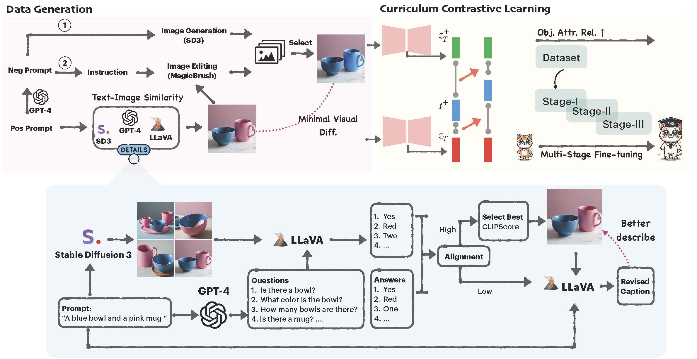

# Progressive Compositionality in Text-to-Image Generative Models

[](https://arxiv.org/pdf/2410.16719)   [](https://evansh666.github.io/EvoGen_Page/)

**This is the official repository for "[Progressive Compositionality in Text-to-Image Generative Modelss](https://evansh666.github.io/EvoGen_Page/)".**


## ✨ Abstract

Despite the impressive text-to-image (T2I) synthesis capabilities of diffusion models, they often struggle to understand compositional relationships between objects and attributes, especially in complex settings. Existing solutions have tackled these challenges by optimizing the cross-attention mechanism or learning from the caption pairs with minimal semantic changes. However, *can we generate high-quality complex contrastive images that diffusion models can directly discriminate based on visual representations?*

In this work, we leverage largelanguage models (LLMs) to compose realistic, complex scenarios and harness Visual-Question Answering (VQA) systems alongside diffusion models to automatically curate a contrastive dataset, CONPAIR consisting of 15k pairs of high-quality contrastive images. These pairs feature minimal visual discrepancies and cover a wide range of attribute categories, especially complex and natural scenarios. To learn effectively from these error cases, i.e., hard negative images, we propose EVOGEN, a new multi-stage curriculum for contrastive learning of diffusion models. Through extensive experiments across a wide range of compositional scenarios, we showcase the effectiveness of our proposed framework on compositional T2I benchmarks. 

## ✨ Data Construction


**Dataset Construction.** To address attribute binding and compositional generation, we propose a new high-quality contrastive dataset, ConPair. Each sample in ConPair consists of a pair of images associated with a positive caption. We construct captions by GPT-4, covering eight categories of compositionality: color, shape, texture, counting, spatial relationship, non-spatial relationship, scene, and complex.

<!-- ## ✨ Method

<p align="center">
  
</p>

<p align="center"><strong>Overview of the EvoGen Framework.</strong></p>
 -->
<!-- ## 🛠️ Environment Setup

- Create Anaconda Environment:
  
  ```bash
  git clone https://github.com/evansh666/EvoGen.git
  cd EvoGen
  ```
  
  ```bash
  conda create -n EvoGen python=3.9
  conda activate EvoGen
  conda install pytorch==2.1.0 torchvision==0.16.0 torchaudio==2.1.0 pytorch-cuda=12.1 -c pytorch -c nvidia
  ```
- Install other requirements:
  
  ```bash
  pip install -r requirements.txt
  ``` -->

<!-- ## 🔮 Pretrained Weights

- Please download the pretrained Audio Compression checkpoint [compression_state_dict.bin](https://drive.google.com/file/d/1o1JznkelMiGizV5RhPIamsi5d5VBs4G_/view?usp=sharing) and VidMuse model checkpoint [state_dict.bin](https://drive.google.com/file/d/1RfVrg3d_UFKL2we8JaVqcnhK4P6TIe_9/view?usp=sharing), put them into the directory `'./model'`. (The VidMuse model is trained with our private dataset.)
  ```bash
  mkdir model
  mv compression_state_dict.bin ./model
  mv state_dict.bin ./model
  ```

## 🔥 Training

- Build data.jsonl file:
  
  ```bash
  python egs/V2M/build_data_jsonl.py
  ```
- Start training:
  
  ```bash
  bash train.sh
  ```
 -->

## 🧱 Dataset & Code

- To be released...


## 🚀 Citation

If you find our work useful, please consider citing:

```
@article{han2024progressivecompositionalitytexttoimagegenerative,
      title={Progressive Compositionality In Text-to-Image Generative Models}, 
      author={Xu Han and Linghao Jin and Xiaofeng Liu and Paul Pu Liang},
      journal={arXiv preprint arXiv:2410.16719},
      year={2024}
}
```

## 📭 Contact

If you have any comments or questions, feel free to contact Xu Han(evanshan69@gmail.com), Linghao Jin(linghaoj@usc.edu).

## License

Please follow [CC-BY-NC](./LICENSE).

<hr>
